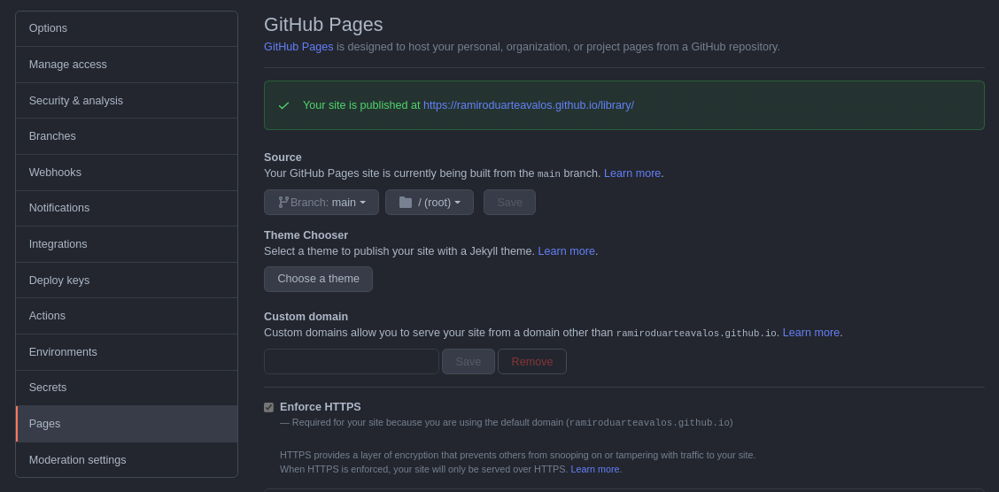
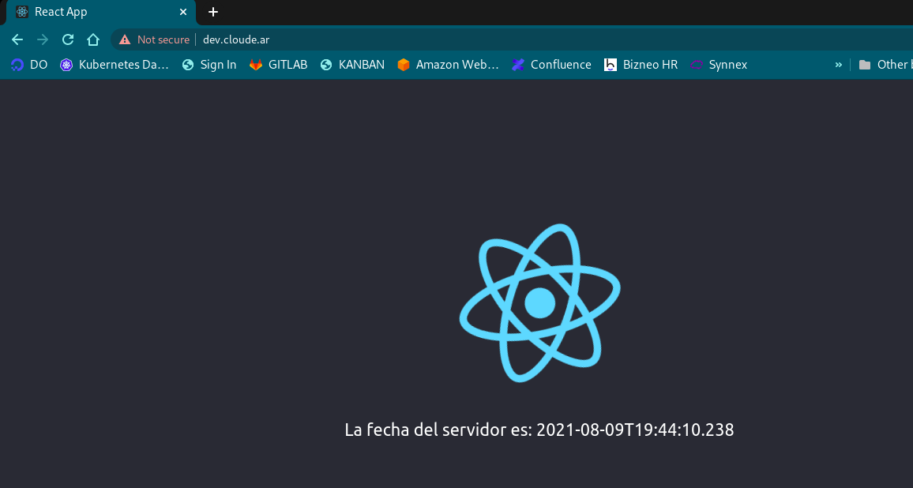
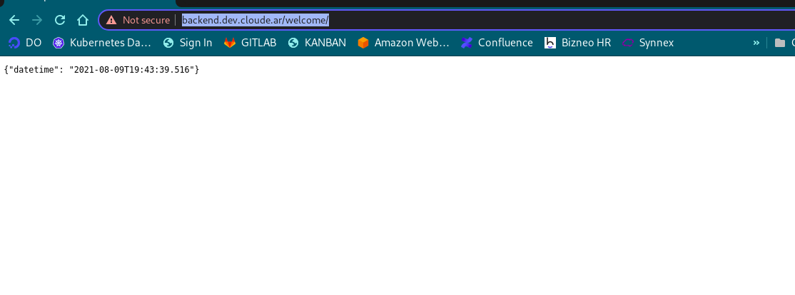

# zebrands-ssessment

## Using infrastructure as code allows you to declare infrastructure components in configuration files that are then used to provision, adjust and tear down infrastructure in various cloud providers. 


* Create [terraform module](https://github.com/ramiroduarteavalos/terraform-eks) 
To run this example you need to execute:

```bash
terraform init 
```

```bash
terraform apply -var-file=xxxxx.xxx.tfvars -state=backup/terraform.tfstate.xxxxx.xxx 
```

* Install [metrics-server](https://artifacthub.io/packages/helm/bitnami/metrics-server)

```
helm upgrade --namespace kube-system metrics-server bitnami/metrics-server     --set apiService.create=true
```

* Install [kong](https://artifacthub.io/packages/helm/kong/kong)

```
kubectl create ns kong
helm repo add kong https://charts.konghq.com
helm upgrade kong --install kong/kong -n kong -f devops/kong/values.${env}.yaml
```

* Configure [dns](https://cloudflare.com)

Create cname dev.cloude.ar --> a864ea16419f54b1998f941a22b0a7e1-1026549549.us-east-1.elb.amazonaws.com 

* Install [cert-manager](https://cert-manager.io/docs/installation/helm/)

```
kubectl apply -f https://github.com/jetstack/cert-manager/releases/download/v1.5.1/cert-manager.crds.yaml
helm repo add jetstack https://charts.jetstack.io
helm upgrade cert-manager --install -n cert-manager --version v1.5.1 jetstack/cert-manager
```

* Create public [helm chart](https://ramiroduarteavalos.github.io/library/charts)



```
helm repo index --url https://ramiroduarteavalos.github.io/library/charts .
helm repo add zebrands https://ramiroduarteavalos.github.io/library/charts
```

* Install [kong-ingress]()

Create kong-ingress helm chart

```
{{- if .Values.ingress.enabled -}}
{{- $fullName := include "zebrands.fullname" . -}}
{{- $svcPort := .Values.service.port -}}
{{- if semverCompare ">=1.14-0" .Capabilities.KubeVersion.GitVersion -}}
apiVersion: networking.k8s.io/v1beta1
{{- else -}}
apiVersion: extensions/v1beta1
{{- end }}
kind: Ingress
metadata:
  name: {{ $fullName }}
  labels:
    {{- include "zebrands.labels" . | nindent 4 }}
  #{{- with .Values.ingress.annotations }}
  annotations:
  #  {{- toYaml . | nindent 4 }}
  #{{- end }}
  kubernetes.io/ingress.class: kong
spec:
  {{- if .Values.ingress.tls }}
  tls:
    {{- range .Values.ingress.tls }}
    - hosts:
        {{- range .hosts }}
        - {{ . | quote }}
        {{- end }}
      secretName: {{ .secretName }}
    {{- end }}
  {{- end }}
  rules:
    {{- range .Values.ingress.hosts }}
    - host: {{ .Values.zebrands.Domain }}
      http:
        paths:
          {{- range .paths }}
          - path: {{ . }}
            backend:
              serviceName: {{ $fullName }}
              servicePort: {{ $svcPort }}
          {{- end }}
    {{- end }}
  {{- end }}

```

```
helm updgrade dev --install zebrands/ingress -n dev -f devops/valus.yaml -f devops/values.dev.yaml 
```

* Execute pipeline [frontend](https://gitlab.com/ramiroduarteavalos/frontend/) && [backend](https://gitlab.com/ramiroduarteavalos/backend/)

| frontend | [url](https://dev.cloude.ar/) |



| backend | [url](https://backend.dev.cloude.ar/welcome/) |



## 🛠️

* [terraform](https://registry.terraform.io/modules/terraform-aws-modules/eks/aws/latest) 
* [Amazon Elastic Kubernetes Service](https://aws.amazon.com/es/eks/?whats-new-cards.sort-by=item.additionalFields.postDateTime&whats-new-cards.sort-order=desc&eks-blogs.sort-by=item.additionalFields.createdDate&eks-blogs.sort-order=desc)
* [helm](https://helm.sh/)

## Authors
| Name | Position |
| ------ | ------ |
| Ramiro Duarte Avalos | DevOps Engineer / SRE |
